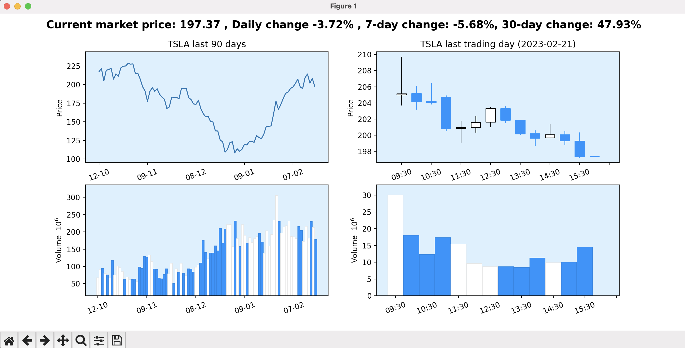

# stockplot

CLI tool to plot historic price movement of a stock ticker
- Work for all tickers listed on Yahoo Finance, including cryptocurrency trading pairs (e.g. TSLA, AAPL, BTC-USD, ETH-USD)

**Input:** One-line command in terminal (stockplot TICKER)


**Output:** Pop-out matplotlib window with historic price movement and trading volumes for that ticker



## Installation
Using [pipx](https://pypa.github.io/pipx/)
```
pipx install stockplot
```

Alternatively, using pip (or pip3):
```
pip install stockplot
```